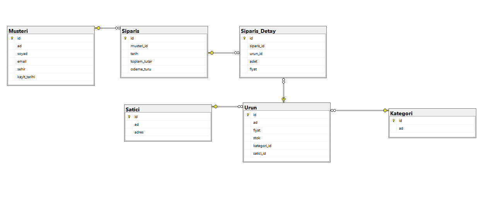

# E-Ticaret Veritabanı Projesi

Bu proje, kapsamlı bir e-ticaret veritabanı sistemini içermektedir. SQL Server kullanılarak tasarlanmış olan bu veritabanı, müşteri yönetimi, ürün kataloğu, sipariş takibi ve satıcı yönetimi gibi e-ticaret işlemlerinin tüm temel bileşenlerini desteklemektedir.

## 📊 Veritabanı Şeması



## 🗂️ Proje Yapısı

```
E-TICARET/
├── README.md                    # Bu dosya
├── ER_Diagram.png              # Veritabanı ER diyagramı
├── SQLQuery_E_TICARET.sql      # Veritabanı oluşturma ve örnek veri scripti
└── Dökümantasyon.docx          # Detaylı dokümantasyon
```

## 🏗️ Veritabanı Yapısı

### Tablolar

#### 1. **Musteri (Müşteri)**
- `id` - Birincil anahtar
- `ad` - Müşteri adı
- `soyad` - Müşteri soyadı
- `email` - E-posta adresi
- `sehir` - Şehir bilgisi
- `kayit_tarihi` - Kayıt tarihi

#### 2. **Kategori**
- `id` - Birincil anahtar
- `ad` - Kategori adı

#### 3. **Satici (Satıcı)**
- `id` - Birincil anahtar
- `ad` - Satıcı adı
- `adres` - Satıcı adresi

#### 4. **Urun (Ürün)**
- `id` - Birincil anahtar
- `ad` - Ürün adı
- `fiyat` - Ürün fiyatı
- `stok` - Stok miktarı
- `kategori_id` - Kategori referansı
- `satici_id` - Satıcı referansı

#### 5. **Siparis (Sipariş)**
- `id` - Birincil anahtar
- `musteri_id` - Müşteri referansı
- `tarih` - Sipariş tarihi
- `toplam_tutar` - Toplam tutar
- `odeme_turu` - Ödeme türü

#### 6. **Siparis_Detay (Sipariş Detayı)**
- `id` - Birincil anahtar
- `siparis_id` - Sipariş referansı
- `urun_id` - Ürün referansı
- `adet` - Ürün adedi
- `fiyat` - Birim fiyat

## 🔗 İlişkiler

- **Müşteri → Sipariş**: 1-N (Bir müşteri birden fazla sipariş verebilir)
- **Sipariş → Sipariş Detayı**: 1-N (Bir sipariş birden fazla ürün içerebilir)
- **Ürün → Sipariş Detayı**: 1-N (Bir ürün birden fazla siparişte bulunabilir)
- **Satıcı → Ürün**: 1-N (Bir satıcı birden fazla ürün satabilir)
- **Kategori → Ürün**: 1-N (Bir kategori birden fazla ürün içerebilir)

## 🚀 Kurulum

1. SQL Server Management Studio'yu açın
2. `SQLQuery_E_TICARET.sql` dosyasını çalıştırın
3. Veritabanı ve örnek veriler otomatik olarak oluşturulacaktır

## 📈 Örnek Sorgular

Proje, aşağıdaki analitik sorguları içermektedir:

### Müşteri Analizi
- En çok sipariş veren 5 müşteri
- Şehirlere göre müşteri dağılımı
- Hiç sipariş vermemiş müşteriler

### Ürün Analizi
- En çok satılan ürünler
- Hiç satılmamış ürünler
- Kategori bazlı satış analizi

### Satıcı Analizi
- En yüksek ciroya sahip satıcılar
- Satıcı performans raporları

### Sipariş Analizi
- Aylık sipariş trendleri
- Ortalama sipariş tutarı analizi
- Ödeme türü dağılımı

## 🎯 Özellikler

- ✅ Tam normalizasyon (3NF)
- ✅ Foreign key kısıtlamaları
- ✅ Otomatik tarih kayıtları
- ✅ Kapsamlı örnek veri seti
- ✅ Analitik raporlama sorguları
- ✅ Performans optimizasyonu

## 📊 Örnek Veri

Proje, aşağıdaki kategorilerde örnek veriler içermektedir:

- **5 Kategori**: Elektronik, Giyim, Kitap, Ev & Yaşam, Spor
- **5 Satıcı**: Farklı şehirlerde konumlanmış
- **10 Müşteri**: Çeşitli demografik bilgilerle
- **15 Ürün**: Farklı kategorilerde çeşitli ürünler
- **10 Sipariş**: Gerçekçi sipariş senaryoları

## 🛠️ Teknolojiler

- **Veritabanı**: Microsoft SQL Server
- **Dil**: Transact-SQL (T-SQL)
- **Araç**: SQL Server Management Studio


